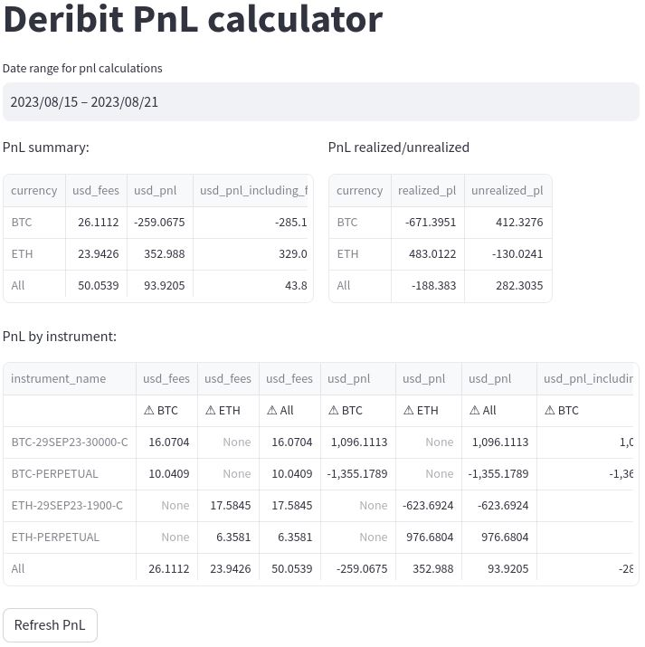

# Deribit PnL Calculator App (realized + unrealized)

This is a Streamlit app that calculates and displays Profit and Loss (PnL) information for trades on the Deribit cryptocurrency exchange. It utilizes the Deribit API to fetch trade and price data, and a SQLite database to store transaction records. The app displays PnL summaries by currency and instrument, and allows users to refresh the PnL calculations.


## Features

- Calculate and display PnL information for trades on Deribit.
- Filter PnL data by date range.
- Display PnL summaries by currency and instrument.
- Refresh PnL calculations using the Deribit API.

## Getting Started

1. Clone the repository:

   ```bash
   git clone https://github.com/your-username/deribit-pnl-calculator.git
   cd deribit-pnl-calculator
   ```

2. Install the required packages:

   ```bash
   pip install -r requirements.txt
   ```

3. Configure the app:

   - Create a `config.json` file with your Deribit API credentials and other configuration options.

4. Run the app:

   ```bash
   streamlit run streamlit_gui.py
   ```

5. Use the app:

   - Select a date range for PnL calculations.
   - View PnL summaries by currency and instrument.
   - Click the \"Refresh PnL\" button to update calculations.

## Dependencies

- Python 3.7+
- Streamlit
- pandas
- asyncio
- websockets
- SQLite

## Configuration

Create a `config.json` file in the project root with the following structure:

```json
{
  "db_path": "path/to/your/database.db",
  "deribit": {
    "client_id": "your_client_id",
    "client_secret": "your_client_secret",
    "client_url": "wss://www.deribit.com/ws/api/v2"
  }
}
```
Replace path/to/your/database.db with the path to your SQLite database.

## License

This project is licensed under the MIT License.

